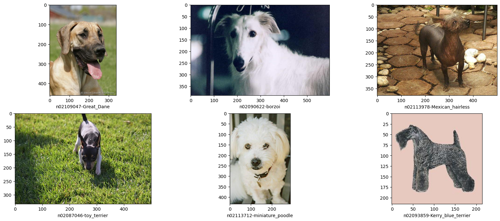
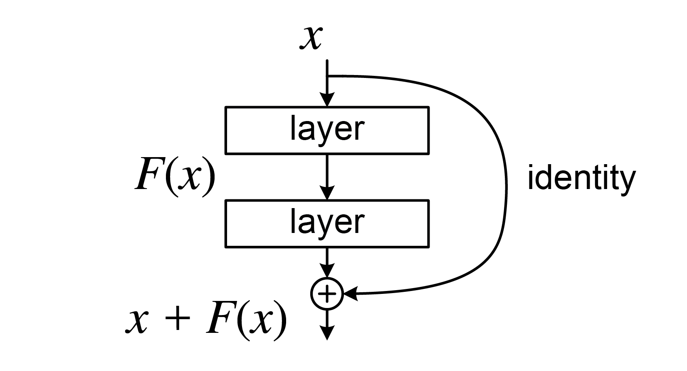
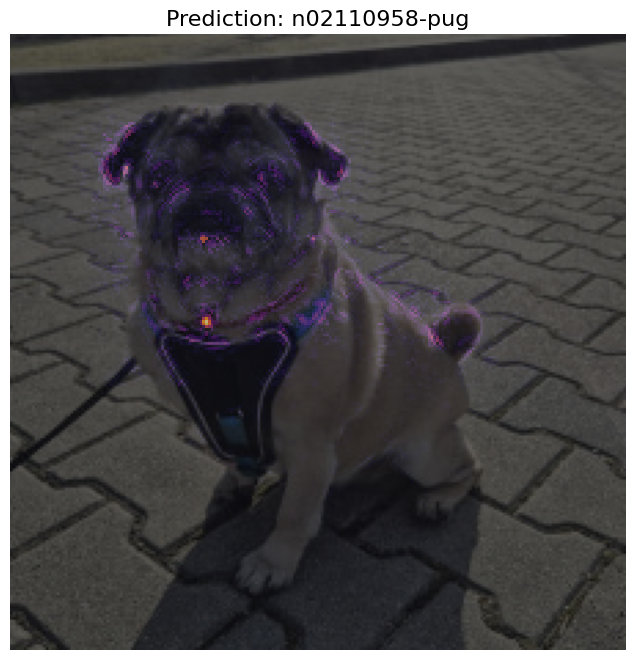

# Intro
This repository contains an overview of XAI (Explainable AI) in classification problem. The main idea of this project is summing up 
the most popular methods with not overcomplicated example.

## Dataset
The Stanford Dogs dataset contains images of 120 breeds of dogs from around the world. This dataset has been built using images and annotation from ImageNet for the task of fine-grained image categorization. It was originally collected for fine-grain image categorization, a challenging problem as certain dog breeds have near identical features or differ in colour and age.

From kaggle: https://www.kaggle.com/datasets/jessicali9530/stanford-dogs-dataset  
Originally from http://vision.stanford.edu/aditya86/ImageNetDogs/

## ResNet
All methods in this repository are used to explain decision of ResNet architecture.

ResNet is Convolutional Neural Network (CNN) architecture in which layers learn residual function with reference to the layer inputs.
In this repo I decided to use ResNet18(the smallest version of ResNets) as model performance optimization is not the main purpose. 

More about ResNet in following paper: https://arxiv.org/abs/1512.03385

# Gradient Based Methods
Soon, here I will introduce following gradient methods.

## Gradient-weighted Class Activation Mapping (GradCAM)

On this figure you can see GradCAM visualisation of ResNet 18 classifying my dog Klopsia correctly as pug.
The GradCAM algorithm was performed on layer4 as it was the layer fine tuned for this specific classification problem.

Read more: https://arxiv.org/abs/1610.02391

## Integrated Gradients

Read more: https://arxiv.org/abs/1703.01365