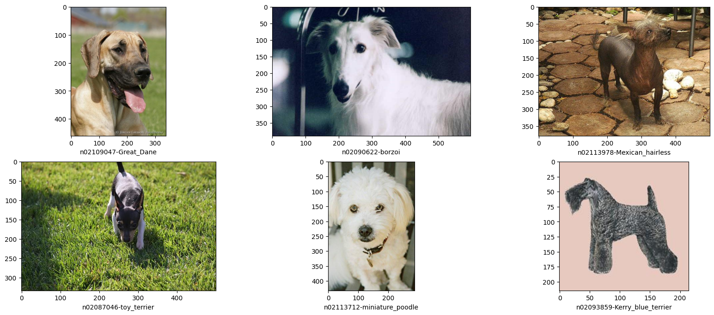
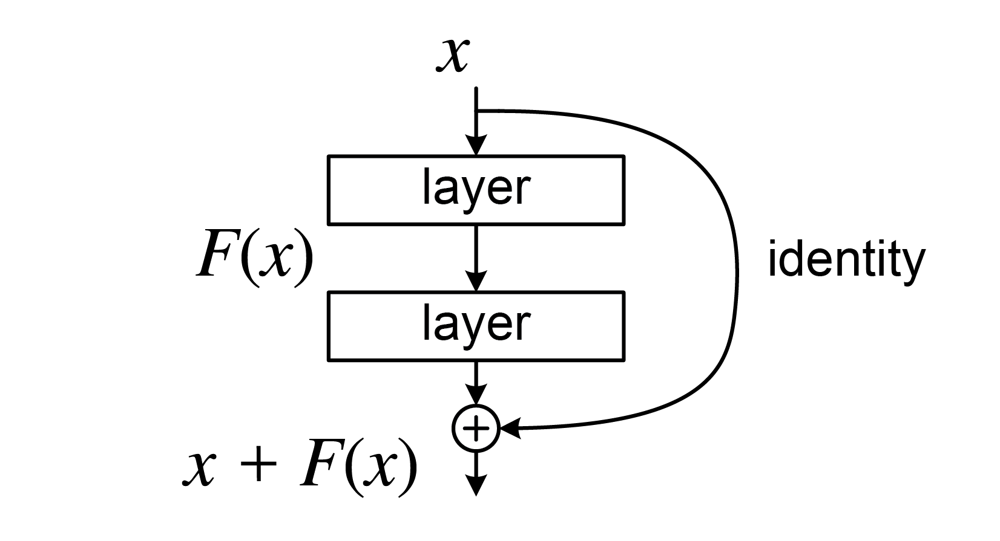
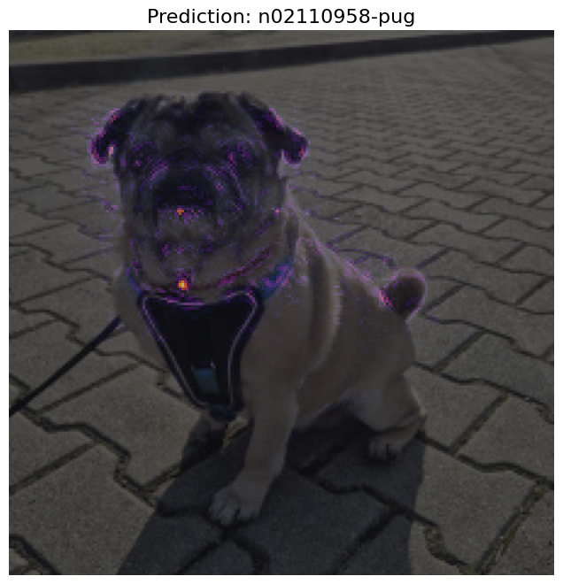
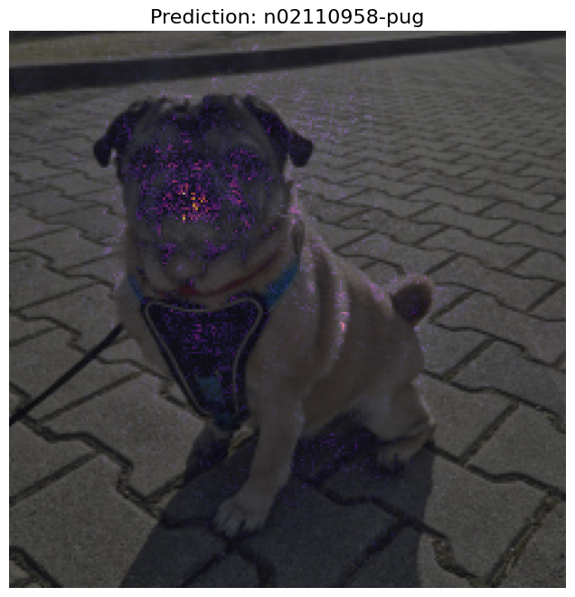
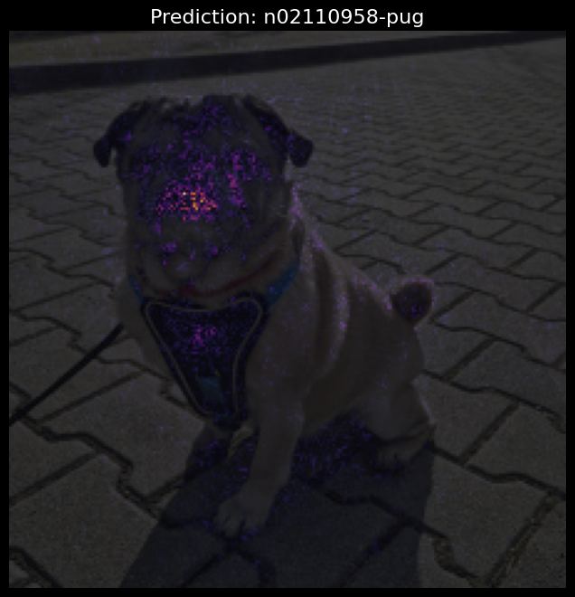
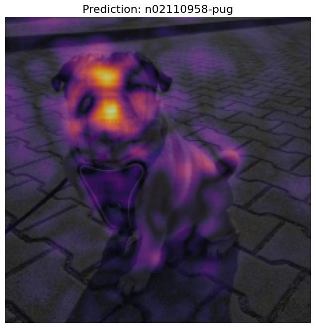
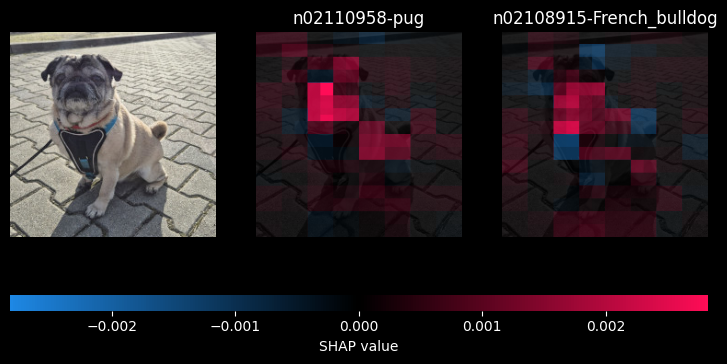
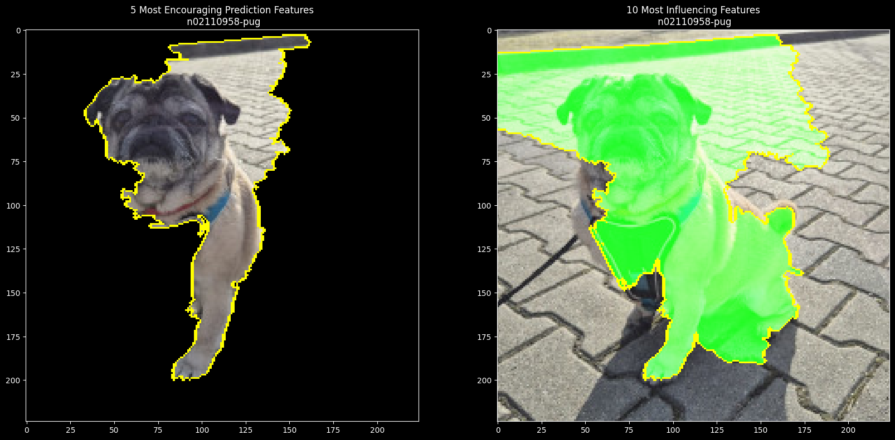

# Intro
This repository contains an overview of XAI (Explainable AI) in classification problem. The main idea of this project is summing up 
the most popular methods with not overcomplicated example. For this specific example I decided to fine tune pretrained resnet18 model from torch. 
Fine-tuning was performed on forth layer and fully connected layer (fc).  

## Dataset
The Stanford Dogs dataset contains images of 120 breeds of dogs from around the world. This dataset has been built using images and annotation from ImageNet for the task of fine-grained image categorization. It was originally collected for fine-grain image categorization, a challenging problem as certain dog breeds have near identical features or differ in colour and age.

From kaggle: https://www.kaggle.com/datasets/jessicali9530/stanford-dogs-dataset  
Originally from http://vision.stanford.edu/aditya86/ImageNetDogs/

## ResNet
All methods in this repository are used to explain decision of ResNet architecture.

ResNet is Convolutional Neural Network (CNN) architecture in which layers learn residual function with reference to the layer inputs.
In this repo I decided to use ResNet18(the smallest version of ResNets) as model performance optimization is not the main purpose. 

More about ResNet in following paper: https://arxiv.org/abs/1512.03385

# Gradient Based Methods
Soon, here I will introduce following gradient methods.

## Guided Gradient-weighted Class Activation Mapping (GradCAM)

 
On this figure you can see Guided GradCAM visualisation of ResNet 18 classifying my dog Klopsia correctly as pug.
The Guided GradCAM algorithm was performed on layer4 as it was the layer fine tuned for this specific classification problem.
Shortly, the Guided GradCam algorithm is a combination of GradCam algorith with Guided backpropagation resulting in edge like heat map output of
region of intrest in specific layer.

Read more: https://arxiv.org/abs/1610.02391

## Integrated Gradients

On this figure you can see Integrated Gradients method performed with the whole fine tuned resnet18 as a forward function.
This method gives us more overall idea of what influenced model decision. Long story short ingradient gradient are an importance score for each
input pixel given by approximation of the integral of gradients of the model's output with respect to the input. 

Read more: https://arxiv.org/abs/1703.01365

## InpurXGradient

It multiplies input with the gradient with respect to input. This method performed on the fine tuned resnet18
provides a overall view how gradients values influence prediction result simpy multiplying input times gradients related with prediction.

Read more: https://arxiv.org/abs/1605.01713
# Occlusion

Occlusion is a permutation methods for explaining CNNs for classification tasks. In this method we give net model 
image to predict multiple times each time covering different part of input image along with target prediction. Basing on target class
probability the algorithm calculates the heat map of area importance in prediction.

Read more: https://arxiv.org/abs/1311.2901

# Post-hoc agnostic methods
**Post-hoc** methods is a family of methods that explain model locally meaning in specific prediction.

**Agnostic** methods are these that could be used for any model architecture or even purpose.
For this model we only need to mark specific features that could be used for fitting any explainable model or method.

## Shapley Values

The shapley values is term from game theory. This values calculates how much each
feature contributed to model output. The algorithm calculates specific feature contribution
by comprehension of prediction with and without this specific feature. In this specific example I treat 
any 2x2 pixel square as feature and absence of this feature is marked by blur-ing it.

In this is specific example I used [SHAP library](https://shap.readthedocs.io/en/latest/index.html).
 Read More: https://link.springer.com/article/10.1007/s10115-013-0679-x

## LIME (Local Interpretable Model-Agnostic Explanations)

The LIME Explanations works by approximating model prediction with simpler (smaller) explainable models.
In image data XAI  we create features by splitting image into "tiles" so-called superpixels
(this specific library uses **quickshift** algorithm). 
Then algorithm finds the most influencing superpixels by perturbation features our model predictions to create weights, 
then we use simple interpretable model to obtain feature importance.

In this is specific example I used [lime library](https://github.com/marcotcr/lime).
 Read More: https://arxiv.org/abs/1602.04938

